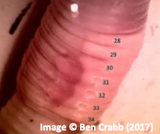
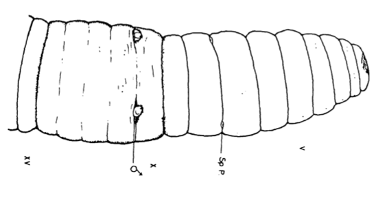
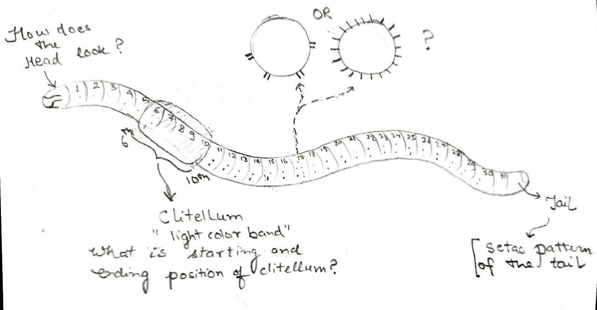
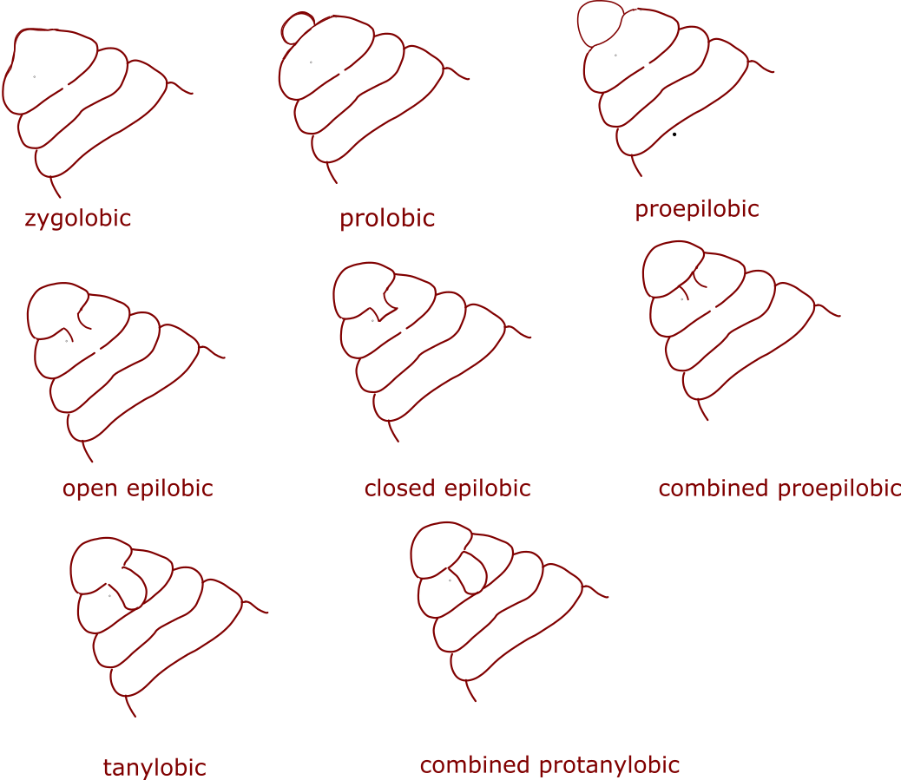
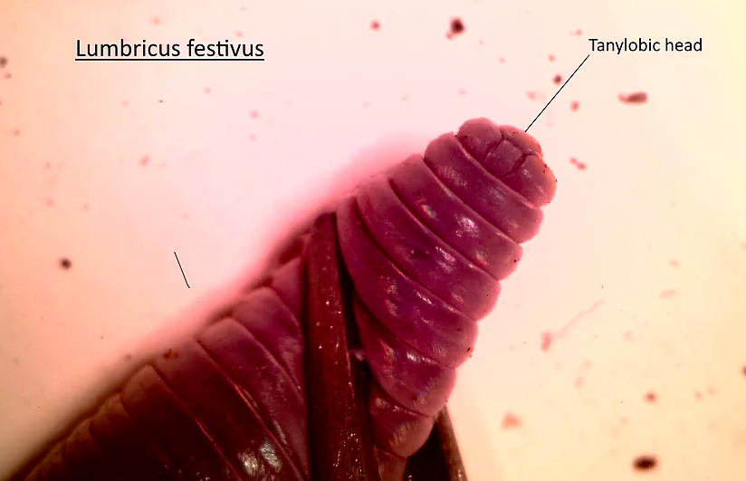
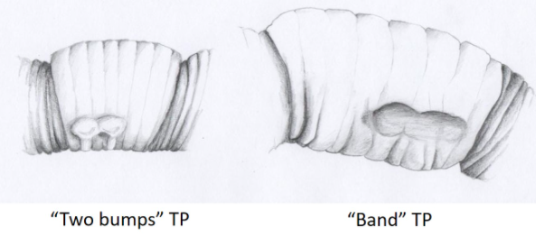
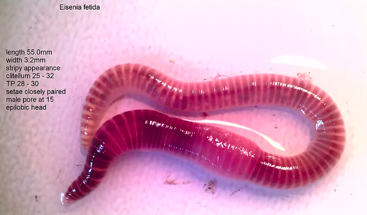
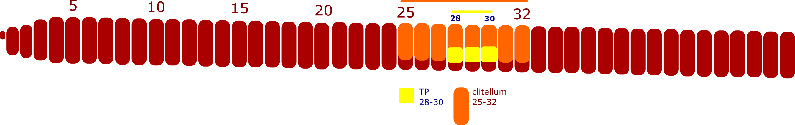
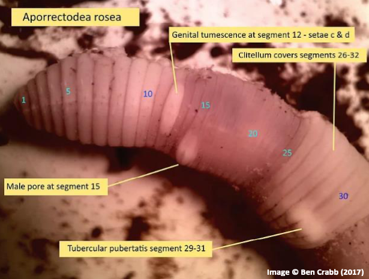

Ravi Sinha 
Gnowledge Lab, HBCSE
28 September 2020

*This is working draft*

## Abstract

Earthworms identification and mapping are important exercises to record and study the global distribution of different species by scientist and researchers. This is a short article which describes the importance of identifying earthworms and ways in which community members can play an active role in spreading awareness by participating peripherally in the scientific endeavor and making significant contribution to expand the knowledge base.

> Keywords: earthworm recorder, identification, species, distribution, citizen science

## Why do you need to identify the worm?

You must have seen(although cursorily) these reddish crawly beings especially during rainy days on the roads or in the fields. These little creatures are earthworms and in this article, we are going to have a closer look at some of those.

Earthworms are considered to be extremely useful for soil fertility. They are the farmers' best friend. They are a good indicator of soil health and their diversity and abundance in the soil influence the its properties. You may be wondering, why would scientists and researchers be interested in identification and mapping of the earthworms? Understanding the global distribution of the earthworms can enable researchers to investigate several important questions around ecology(the study of the relationships between organisms and their environment), evolution, ecotoxicology(the study of the effects of toxic chemicals on biological organisms), and conservation. (Julka, 1993; Cameron et al.). 

Biologist and researchers also need to understand the distribution of under the earth biodiversity to identify and protect regions to preserve it. Earthworms play major role in that too. This article outlines the following,  

- it will help you develop an appreciation for these worms
- it will invite you to play an active role as a citizen scientist to help record and discover different kinds of earthworms.

So, let us begin!

## Search

The first step is to capture a worm from your locality. Earthworms can be found in many places. You can find them in fields, on roads, in garden, in pots etc.  You can pour little soap solution on the patch of soil where you think they are more likely to be found and wait for them to come out. The solution will irritate the skin of the worm making them come to surface (if of course they are in there). You can also use a plastic glass along with some wet tissue paper to create a temporary shelter for the worm. Before you capture the worm, the question we have to ask is - Can we catch any worm? 
Generally, it is observed that adult worm those who are sexually mature are easier to identify as compared to the younger ones. They have external physical features which are visible by naked eyes. (Julka, 1993; James, 2004; Brown, 2019). What exactly is the feature that distinguish an adult worm from younger ones? In mature worms, you will find that they have a thick band near its head. This band is of different colour as compared to that of the body. This visual clue makes it easy for you to distinguish young ones from the adult. This band is called the clitellum. Here is the image and illustration of clitellum,

> image of mature worm and young ones

## How do researchers name the earthworms?

> Not all the earthworms are same. They come in various shapes, sizes and colours. There are more than 5000+ different types of earthworms which has been so far documented. These different types of any organism are called species. A species share the genetic code and give birth to fertile offspring. Different species can have a common ancestor, we call group them in a genus. Similarly, the genus can be grouped into family and families can be kept in a larger category known as the kingdom.

Let's try to understand the scientific naming of an organism by taking the example of humans. If you could go back in time just 10,000 years, you would see different species of humans living in different parts of earth in the same time? (Harari, 2011) Unfortunately, only the homo sapiens(us!) has been able to survive so far and others have become extinct.

Humans belong to the Kingdom- Animals. There are other kingdoms too like plants, fungi! A kingdom has many families. Humans belong to the apes family. No wonder, why chimpanzees and monkeys are our closest relative. 

Kingdom (Animals) -> Family (Apes)

Within a family, we can further group organisms in Genus. Humans belong to 'homo' genus.

Kingdom (Animals) -> Family (Apes) -> Genus (Homo)

Within a genus, we have species. Humans are one of the species in Homo genus i.e. Sapiens. 

Now lets focus on the scientific naming part. Its written in Latin where the first word is genus followed by species. For us, it will be Homo Sapiens (Genus Species).

Kingdom (Animals) -> Family (Apes) -> Genus (Homo) -> Species (sapiens)

Here are examples of other extant species of the genus homo,

|Genus Species|
|---|
|Homo soloensis|
|Homo erectus|
|Homo neanderthalensis|
|Homo sapiens|
|Homo floresisensis|
|Homo denisova|
|Homo rudilfensis|

Earthworms belong to Kingdom Animalia. There are many types of worms which can be further classified into different families, genus, and species and are distributed across the world.

In 2019, the first-ever global map of earthworms diversity was published which collated data from 6928 sites in 57 countries. The data below indicates the global distribution of species richness. (Phillips et al., 2019)

So, now you have a better idea of the diversity and how scientific naming is done, so let's finish our detour and move to the next resource which comes handy for any earthworm recorders.

## What are identification keys? 

Researchers make species-specific identification keys which can be useful if you are trying to identify unknown earthworms. There are different kinds of keys which are designed based on varying design consideration. For instance, James (James, 2004) designed a key which can be used to identify some species of earthworms just from their external features. However, to have precise identification, one also needs to look deeper and uncover the details of internal organs to correctly identify a particular species. For instance, the examination of the reproductive organs has been one of the main sources to distinguish different species(Julka, 1993).

Here are a couple of things to take care while using identification keys,

- These are species-specific hence limited in utility. Only those species can be identified which are there in a particular key. Hence, if you accidentally discover new species or an existing species which is not there in the key, you won't be able to identify the worm.
- That brings us to the next limitation. These keys are contextualized. That means you can't use the key made by someone for a different geographical area to identify worms in your region unless you are sure that the same species are known to be found in your region. 
- Inaccuracies. Also, it is to be noted that there can be inaccuracies in the identification of species while using a key which is just based on physical features. (James, 2004; Brown, 2019) One needs to look at the internal organs and structure of worm to be able to tell the species with greater accuracy. There are earthworms which looks exactly similar based on external features but yet they belong to different species. This is only revealed once you examine their internal structure which turns our to be different. Also, there  can be differences in the physical features of two worms yet they can belong to the same species. However, these cases are lesser in number. 

Scientists have broad ideas of which kinds of worm species are found in particular regions. Hence, one can use a given key where there is mention of that particular species. J M Jumla has studied the distribution of worms in Orissa, India. (Julka, 1976) So, if you are living there, it would be useful to have a key which has detailed features to map some of the already reported species in that region. You might not have region-specific keys, but if you look at some of the common features, you will be able to at least have some head start clues to enrich the existing repertoire of know-how for a specific region. As you already have  realized, there is a need for many earthworm recorders so that we can collectively help in mapping the species distribution across geographies!

## Observe

Now that you have the mature worm, we are ready to have a closer look and take detailed notes! You can also keep a magnifying glass of 10X handy along with your notebook and mobile phone for documentation.

The below observation list isn't prescriptive hence need not be followed step-by-step. Feel free to carry your investigation depending on your curiosity. The section is meant to give a tentative idea of some of the important features which are considered important while trying to identify earthworms based on external features.

### Length and Color

One of the first step could be to record the color of the body and that of clitellum. Also, noting down the color of tip of the tail will be helpful. Do you notice any other prominent mark?
Here is an example of the same,

### Counting the segments!

Earthworm body is made up of many segments. It has been found that counting the number of segments from head to clitellum is an important indicator to distinguish different species. Also, the segments which the clitellum occupies is also same in a particular species. Isn't this fascinating? A simple count of segments  in clitellum and the starting position of clitellum can be an important clue to differentiate one species from the other!

Okay, coming back to the data collection part. Take note of the following,  

- Count of the number of the segments on the earthworm
- Count of the number of the segments from the head to the beginning of the clitellum.
- Count of the number of segments clitellum is made up of

### How does the face look like?

How does the 1st segment i.e the head looks like? The first segment of the worm is called peristomium (per). It also have a tongue kind of structure known as prostomium (pr). This tongue kind of structure helps earthworm sense the environment. They don't have eyes and ears! The shape of prostomium is important clue in species identification.

image credits Ben 

image credits Ben 

Examine carefully your worm and try to take a close up picture of the same. You can also use a magnifying glass/USB microscope for better clarity. Also, try sketching the picture as shown above!

### Pattern of hair-like part on earth?

Closely paired setae
Widely Paired setae

In earthworm identification, the pattern of setae on a single segment is important feature to notice.

Setae helps in movement and maintaining the grip when the worm moves.

### Tubercula Pubertatis (TP) 

On the clitellum, you will find bumps which are known as Tubercula Pubertatis(TP). Tuberculum in latin means a little swelling. These little swelling helps earthworms maintain grip during mating process. The segment numbers they cover and the shape of TP are important feature to distinguish between the species. TP is however difficult to see with naked eye.

Image courtesy of Charlie Bell

### What else did you observe?

Look the underneath of the earthworm. Do you see any kind of pattern there? Keep a record of the  location of that segment starting from the head.

## Step 3: Share your data with the community! 

Once you have documented the data you can release the earthworm back safely in the nature or you can make a temporary shelter and keep it there. After that, you can send the mail to some of the groups who can help you narrow your clues to identifying species. Here are some of the groups which might be helpful where you can share your observations,

If you can get access to microscope, you can also capture these magnified image of the earthworms and share with the community. Here is the amazing work done be Ben Crabb.

## Conclusion

Although it's not possible to accurately name the earthworm (identify the species of earthworm based on photographs and observations of external features, still this exercise of observing the worm closely and knowing a little more about your hardworking neighbours should have been fun and full of surprises. This also might be your first step towards participating in a citizen science endeavour. There are many such projects where citizens can play an active role in directly helping the scientific community to construct knowledge. Another example could be projects such as making your own weather station and publishing data online.Multiple such weather stations in a particular region can contribute to the hyper-local data collection which can be useful for the meteorologist to study variation in the weather  and increase the accuracy of the prediction. At the same time, participation in citizen science projects is always fun learning exercise too as you get to learn so many different things in the process. HBCSE MakerSpace has initiated one such projects in DIY weather station . You can look about that here:

## Acknowledgement

The author would like to thank the Gnowledge Lab CUBE group who have been working with earthworm as a model system for their feedback and valuable comments.

## References

- Blakemore, R. J. and Kupriyanova, E. K. (no date) ‘Unraveling some Kinki worms (Annelida: Oligochaeta: Megadrili: Moniligastridae) - Part I’, p. 16.  
- Brown, K. D. (2019) ‘NERS Earthworm Recorder’s Handbook v8’. Earthworm Society of Britain.  
- Cameron, E. K. et al. (2016) ‘Earthworm databases and ecological theory: Synthesis of current initiatives and main research directions’, Applied Soil Ecology, 104, pp. 85–90. doi: 10.1016/j.apsoil.2015.11.012.  
- Crabb, B. (2017a) annotated picture of earthworm. Available at: https://bjc792.wixsite.com/earthworm-images/aporrectodea-rosea.  
- Crabb, B. (2017b) epilobic head and closely paired setae. Available at: https://bjc792.wixsite.com/earthworm-images/aporrectodea-caliginosa.
- Crabb, B. (2017c) tanylobic head. Available at: https://bjc792.wixsite.com/earthworm-images/lumbricus-terrestris.
- Edwards, C. A. and Lofty, J. R. (1977) Biology of Earthworms. Boston, MA: Springer US. doi: 10.1007/978-1-4613-3382-1.
- Harari, Y. N. (2011) Sapiens. Vintage Books.
- James, S. W. (2004) ‘An illustrated key to the earthworms of the Samoan Archipelago (Oligochaeta: Glossoscolecidae, Megascolecidae, Moniligastridae)’, p. 13.
- Julka, J. M. (1976) ‘Studies on the earthworm fauna of Orissa (India). 1. Moniligastridae and Ocnerodrilidae’, Mitteilungen aus dem Museum für Naturkunde in Berlin. Zoologisches Museum und Institut für Spezielle Zoologie (Berlin), 52(2), pp. 321–329. doi: 10.1002/mmnz.19760520206.
- Julka, J. M. (1993a) Distribution Pattern in Indian Earthworms, Earthworm Resources and Vermiculture. Calcutta: Zoological Survey of India.
- Julka, J. M. (1993b) General Morphology and Characters of Taxonomic Importance, Earthworm Resources and Vermiculture. Calcutta: Zoological Survey of India.
- Paliwal, R. and Julka, J. M. (2005) ‘Checklist of earthworms of western Himalaya, India’, Zoos’ Print Journal, 20(9), pp. 1972–1976. doi: 10.11609/JoTT.ZPJ.1195.1972-6.
- Phillips, H. R. P. et al. (2019) ‘Global distribution of earthworm diversity’, p. 8.
- Sinha, M. P., Srivastava, R. and Kumar, M. (2003) ‘Systematics of Earthworms from Jharkhand. I. Moniligastridae’, Proc Zool. Soc. India, 2(2), pp. 15–20.
